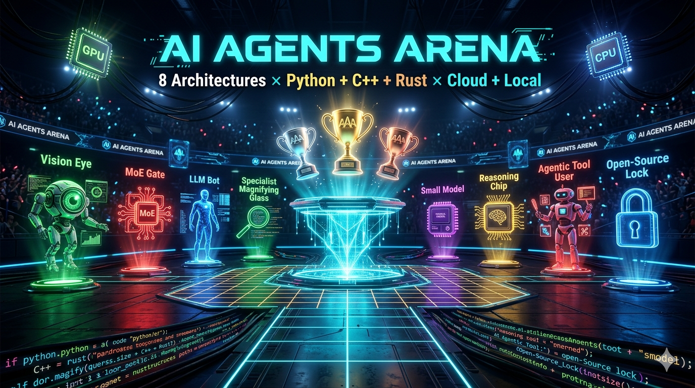
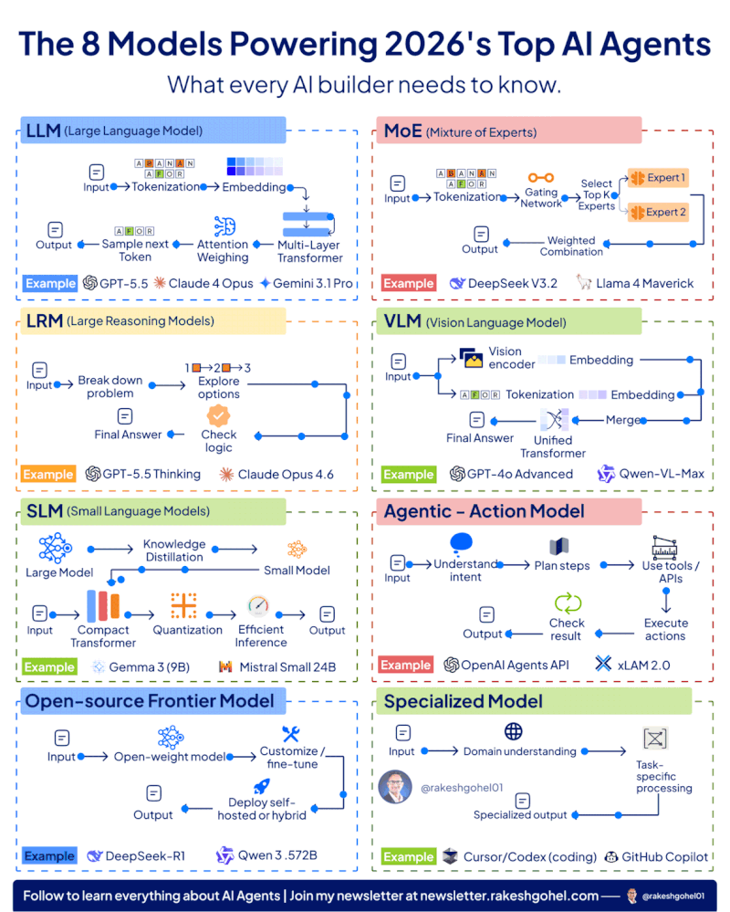
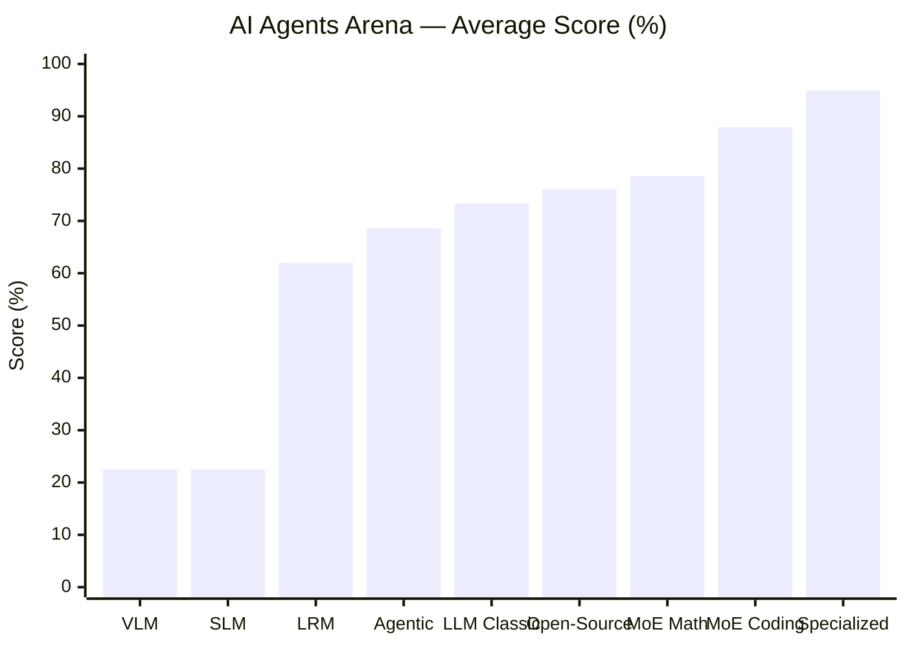
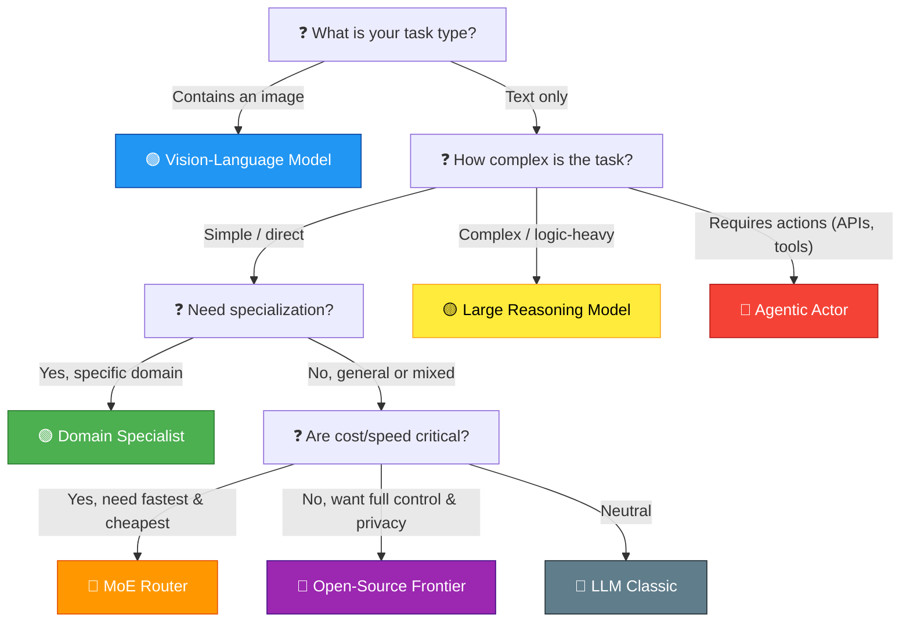
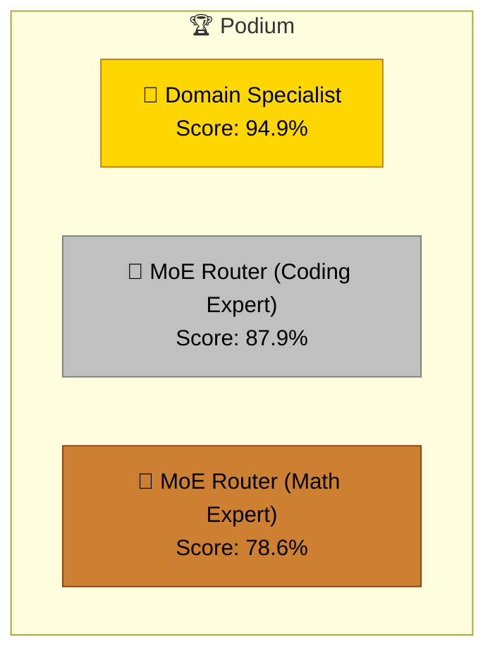

# 🏟️ AI Agents Arena

### 8 Agent Architectures × Python + C++ + Rust × Cloud + Local

> Every agent type from the infographic — programmed, benchmarked, competing.  
> From cloud APIs to on‑device llama.cpp, from LLM to Vision‑Language Models.

[](LICENSE)
[](https://www.python.org/)
[](https://www.rust-lang.org/)
[](https://isocpp.org/)
[](https://mermaid-js.github.io/)

<div style="display: flex; justify-content: left; gap: 10px;">
  
  
</div>
---

## 📚 Table of Contents

- [📖 Overview](#-overview)
- [🗺️ Project Structure](#️-project-structure)
- [⚡ Quick Start (Python + OpenRouter)](#-quick-start-python--openrouter)
- [🤖 The 8 Agent Types](#-the-8-agent-types)
- [🖥️ Local Inference (Hardware‑Aware)](#️-local-inference-hardware-aware)
- [🦀 Rust Local (candle)](#-rust-local-candle)
- [⚙️ C++ Local (llama.cpp)](#️-c-local-llamacpp)
- [🔧 Python: Run a Single Agent](#-python-run-a-single-agent)
- [🏆 Competition Output & Leaderboard](#-competition-output--leaderboard)
- [📈 Performance Visualizations (Mermaid)](#-performance-visualizations-mermaid)
- [📦 Fine‑tuning Open‑Source Models](#-fine-tuning-open-source-models)
- [🌐 OpenRouter Free Models](#-openrouter-free-models)
- [🤝 Contributing](#-contributing)
- [📄 License](#-license)

---

## 📖 Overview

**AI Agents Arena** is a benchmark harness that pits **8 distinct AI agent architectures** against a suite of tasks.  
It demonstrates:

- **No single architecture wins everywhere.**
- **Domain specialisation** often beats raw model size.
- **Local inference** (C++/Rust/Python) can match cloud APIs for many workloads.
- **Hybrid orchestration** (MoE routing, LRM reasoning, Agentic tools) yields the highest quality.

The arena supports three backends:
- **Cloud** (OpenRouter API – GPT, Claude, Gemini, DeepSeek, Llama …)
- **Local Python** (llama‑cpp‑python, GGUF models)
- **Local Rust** (candle, with CUDA/Metal acceleration)
- **Local C++** (llama.cpp, raw GPU inference)

All 8 agent types are implemented from scratch, using a common `BaseAgent` interface.

---

## 🗺️ Project Structure

```
ai_agents_arena/
├── main.py                    # ← START HERE
├── config.py                  # OpenRouter models + competition config
├── hardware_detect.py         # Auto GPU/VPU/CPU detection
├── requirements.txt
│
├── agents/
│   ├── base.py                # Abstract BaseAgent (OpenRouter + local)
│   └── all_agents.py          # All 8 agent types
│
├── competition/
│   └── arena.py               # Competition runner + leaderboard
│
└── local/
    ├── cpp/
    │   ├── llm_inference.cpp  # llama.cpp C++ — all 8 agents
    │   └── CMakeLists.txt
    └── rust/
        ├── src/main.rs        # candle Rust — all 8 agents
        └── Cargo.toml
```

---

## ⚡ Quick Start (Python + OpenRouter)

```bash
# 1. Install
pip install -r requirements.txt

# 2. Set your free OpenRouter API key
#    Get one at: https://openrouter.ai/keys
export OPENROUTER_API_KEY=sk-or-v1-your-key-here

# 3. Run!
python main.py --demo           # quick demo (1 task)
python main.py                  # full competition (5 tasks)
python main.py --show-hw        # hardware report
python main.py --list-tasks     # see all tasks
```

---

## 🤖 The 8 Agent Types

| # | Type | Architecture | Best For | Cloud Model |
|---|------|-------------|----------|-------------|
| 1 | **LLM** | Input→Tokenize→Embed→Transformer→Output | General tasks | GPT‑4o‑mini |
| 2 | **MoE** | Gating→Top‑K Experts→Weighted Combine | Diverse tasks | DeepSeek V3 |
| 3 | **LRM** | Breakdown→Explore→Check Logic→Answer | Complex reasoning | DeepSeek‑R1 |
| 4 | **VLM** | Vision Encoder + Text Tokens → Merge | Image+text | Gemini Flash |
| 5 | **SLM** | Distilled→Quantized→Efficient Inference | Edge/offline | Phi‑3‑mini |
| 6 | **Agentic** | Intent→Plan→Tools→Execute→Check | Multi‑step tasks | GPT‑4o‑mini |
| 7 | **Open‑Source** | Open‑weight→Fine‑tune→Deploy | Custom/private | Llama‑3.3‑70B |
| 8 | **Specialized** | Domain→Task‑specific→Expert Output | Domain tasks | Claude Haiku |

Each agent can be instantiated and tested individually (see [Python: Run a Single Agent](#-python-run-a-single-agent)).

---

## 🖥️ Local Inference (Hardware‑Aware)

### Python (llama‑cpp‑python)

```bash
# Download a GGUF model first
huggingface-cli download \
    bartowski/Llama-3.1-8B-Instruct-GGUF \
    Llama-3.1-8B-Instruct-Q4_K_M.gguf \
    --local-dir ./models/

# Run with local backend
python main.py --backend local --task coding
```

### Auto Hardware Selection

| Hardware | Tier | Model Size |
|----------|------|-----------|
| NVIDIA GPU ≥20GB | large | 70B Q4 |
| NVIDIA GPU 8‑20GB | medium | 8B Q4 |
| NVIDIA GPU 4‑8GB | small | 2B Q4 |
| Apple Silicon ≥32GB | large | 70B Q4 |
| Apple Silicon 16GB | medium | 8B Q4 |
| Intel NPU/VPU | small | 2B OpenVINO |
| CPU only | tiny | 360M‑1.7B Q4 |

---

## 🦀 Rust Local (candle)

```bash
cd local/rust

# CPU
cargo run --release -- --all

# NVIDIA GPU
cargo run --release --features cuda -- --all

# Apple Silicon
cargo run --release --features metal,accelerate -- --all

# Single agent with custom prompt
cargo run --release -- --agent lrm --prompt "Prove sqrt(2) is irrational"
```

---

## ⚙️ C++ Local (llama.cpp)

```bash
cd local/cpp

# Clone llama.cpp
git clone https://github.com/ggerganov/llama.cpp

# Build (CPU)
cmake -B build && cmake --build build --config Release -j$(nproc)

# Build (CUDA)
cmake -B build -DGGML_CUDA=ON && cmake --build build -j$(nproc)

# Compile
g++ -std=c++17 -O3 -I llama.cpp/include -I llama.cpp/ggml/include \
    llm_inference.cpp -L llama.cpp/build/src -lllama -lggml \
    -Wl,-rpath,llama.cpp/build/src -o llm_inference

# Run all 8 agent types
./llm_inference models/llama-3.1-8b.Q4_K_M.gguf \
    "Explain attention mechanism" LRM
```

---

## 🔧 Python: Run a Single Agent

```python
from agents.all_agents import LRMAgent, AgenticAgent, MoEAgent

# Reasoning agent
lrm = LRMAgent("My Reasoner", "deepseek/deepseek-r1")
resp = lrm.run("If all roses are flowers, and some flowers fade quickly, can we conclude that some roses fade quickly?")
print(resp.pretty())

# Agentic agent with tool use
agent = AgenticAgent("My Actor", "openai/gpt-4o-mini")
resp = agent.run("Calculate the factorial of 12, then check if it's divisible by 7")
print(f"Tools used: {resp.tools_used}")
print(f"Answer: {resp.response}")

# MoE with automatic expert routing
moe = MoEAgent("My MoE", "deepseek/deepseek-chat")
resp = moe.run("Write a Python function to merge two sorted arrays")
# → automatically routes to 'coding' expert
print(resp.pretty())
```

---

## 🏆 Competition Output & Leaderboard

When you run `python main.py`, the arena executes all agents on a set of tasks and prints a live scoreboard:

```
🏟️  AI AGENTS ARENA — 8 contestants × 5 tasks


══════════════════════════════════════════════════════════════
  📋 TASK: Multi-step Reasoning
  ❓ A farmer has 17 sheep. All but 9 die. How many are left? Explain step by step....
══════════════════════════════════════════════════════════════
  ✅ 🔵 LLM Classic — 4.72s...
  ✅ 🔴 MoE Router — 2.89s...
  ✅ 🟡 Reasoner (LRM) — 43.59s..^X@sS^X@sA^X@s^S^X@sS^X@ss^X@ss^X@ss^X@ssS
  ❌ 🟢 Vision-LM — 0.26s...
  ❌ 🟣 SLM (Edge) — 0.21s...
  ✅ 🔴 Agentic Actor — 4.08s...
  ✅ 🔵 Open-Source Frontier — 4.95s...
  ✅ 🟢 Domain Specialist — 6.76s...

══════════════════════════════════════════════════════════════
  📋 TASK: Code Generation
  ❓ Write a Python function that finds all prime numbers up to N using the Sieve of ...
══════════════════════════════════════════════════════════════
  ✅ 🔵 LLM Classic — 20.81s..S
  ✅ 🔴 MoE Router — 15.28s..
  ✅ 🟡 Reasoner (LRM) — 37.17s..
  ❌ 🟢 Vision-LM — 0.21s...
  ❌ 🟣 SLM (Edge) — 0.27s...
  ✅ 🔴 Agentic Actor — 12.55s..
  ✅ 🔵 Open-Source Frontier — 26.56s..
  ✅ 🟢 Domain Specialist — 5.60s...

══════════════════════════════════════════════════════════════
  📋 TASK: Text Summarization
  ❓ Summarize the concept of Mixture of Experts (MoE) in AI in 3 bullet points, focu...
══════════════════════════════════════════════════════════════
  ✅ 🔵 LLM Classic — 3.85s...
  ✅ 🔴 MoE Router — 5.59s...
  ✅ 🟡 Reasoner (LRM) — 59.59s..
  ❌ 🟢 Vision-LM — 0.20s...
  ❌ 🟣 SLM (Edge) — 0.26s...
  ✅ 🔴 Agentic Actor — 7.49s...
  ✅ 🔵 Open-Source Frontier — 10.72s..
  ✅ 🟢 Domain Specialist — 7.81s...

══════════════════════════════════════════════════════════════
  📋 TASK: Creative Writing
  ❓ Write a 4-line poem about an AI agent discovering consciousness....
══════════════════════════════════════════════════════════════
  ✅ 🔵 LLM Classic — 2.53s...
  ✅ 🔴 MoE Router — 3.60s...
  ✅ 🟡 Reasoner (LRM) — 57.27s..
  ❌ 🟢 Vision-LM — 0.59s...
  ❌ 🟣 SLM (Edge) — 0.21s...
  ✅ 🔴 Agentic Actor — 20.83s..
  ✅ 🔵 Open-Source Frontier — 4.07s...
  ✅ 🟢 Domain Specialist — 2.33s...

══════════════════════════════════════════════════════════════
  📋 TASK: Data Analysis
  ❓ Given sales data [120, 145, 98, 167, 203, 189, 156], calculate mean, median, and...
══════════════════════════════════════════════════════════════
  ✅ 🔵 LLM Classic — 19.25s..
  ✅ 🔴 MoE Router — 11.36s..
  ✅ 🟡 Reasoner (LRM) — 89.66s..
  ❌ 🟢 Vision-LM — 0.49s...
  ❌ 🟣 SLM (Edge) — 0.25s...
  ✅ 🔴 Agentic Actor — 19.19s..
  ✅ 🔵 Open-Source Frontier — 8.32s...
  ✅ 🟢 Domain Specialist — 6.15s...


══════════════════════════════════════════════════════════════
  🏆  FINAL LEADERBOARD
══════════════════════════════════════════════════════════════
  RANK  AGENT                           AVG SCORE  TASKS
  ───────────────────────────────────────────────────────
  🥇  1   🟢 Domain Specialist                 94.9      5
  🥈  2   🔴 MoE Router [expert:coding]        87.9      1
  🥉  3   🔴 MoE Router [expert:math]          78.6      1
      4   🔵 Open-Source Frontier              76.1      5
      5   🔵 LLM Classic                       73.4      5
      6   🔴 Agentic Actor                     68.6      5
      7   🔴 MoE Router [expert:general]       67.9      1
      8   🔴 MoE Router [expert:writing]       66.7      2
      9   🟡 Reasoner (LRM)                    62.0      5
      10  🟢 Vision-LM                         22.5      5
      11  🟣 SLM (Edge)                        22.5      5
══════════════════════════════════════════════════════════════

  🎉 Winner: 🟢 Domain Specialist


```

> **Note:** The exact scores depend on the tasks, models, and local hardware. The leaderboard above is an example from a reference run. Your results will vary — and that’s the point!  
> The real value is in comparing architectures side‑by‑side.

---

## 📈 Performance Visualizations (Mermaid)

GitHub renders Mermaid diagrams natively. All the charts below are live in this README.  
(To export them as PNG/SVG, copy any block into [mermaid.live](https://mermaid.live) or [mermaid.ink](https://mermaid.ink) and save into `assets/`.)

### 1. Agent Score Comparison (Reference Run)



### 2. Response Time per Task (Gantt)

```mermaid
gantt
    title Response Time per Task (seconds)
    dateFormat X
    axisFormat %s

    section Multi‑step Reasoning
    LLM Classic (4.72s)      :0, 5
    MoE Router (2.89s)       :0, 3
    Reasoner LRM (43.59s)    :0, 44
    Agentic Actor (4.08s)    :0, 4
    Open-Source (4.95s)      :0, 5
    Domain Specialist (6.76s):0, 7

    section Code Generation
    LLM Classic (20.81s)      :0, 21
    MoE Router (15.28s)       :0, 15
    Reasoner LRM (37.17s)     :0, 37
    Agentic Actor (12.55s)    :0, 13
    Open-Source (26.56s)      :0, 27
    Domain Specialist (5.60s) :0, 6

    section Text Summarization
    LLM Classic (3.85s)       :0, 4
    MoE Router (5.59s)        :0, 6
    Reasoner LRM (59.59s)     :0, 60
    Agentic Actor (7.49s)     :0, 8
    Open-Source (10.72s)      :0, 11
    Domain Specialist (7.81s) :0, 8

    section Creative Writing
    LLM Classic (2.53s)       :0, 3
    MoE Router (3.60s)        :0, 4
    Reasoner LRM (57.27s)     :0, 57
    Agentic Actor (20.83s)    :0, 21
    Open-Source (4.07s)       :0, 4
    Domain Specialist (2.33s) :0, 3

    section Data Analysis
    LLM Classic (19.25s)      :0, 19
    MoE Router (11.36s)       :0, 11
    Reasoner LRM (89.66s)     :0, 90
    Agentic Actor (19.19s)    :0, 19
    Open-Source (8.32s)       :0, 8
    Domain Specialist (6.15s) :0, 6
```



### 3. Decision Flowchart: Which Architecture to Use?



### 4. Podium of Champions (Reference)



---

## 📦 Fine‑tuning Open‑Source Models

```python
from agents.all_agents import OpenSourceAgent
agent = OpenSourceAgent("My OSS", "meta-llama/llama-3.3-70b-instruct")
print(agent.fine_tune_example())   # prints full QLoRA fine‑tuning code
```

---

## 🌐 OpenRouter Free Models

These work with `FREE` tier (no cost):
- `meta-llama/llama-3.2-3b-instruct:free`
- `google/gemma-3-4b-it:free`
- `microsoft/phi-3-mini-128k-instruct:free`
- `deepseek/deepseek-r1:free`  ← reasoning, free!

Edit `config.py` → `OPENROUTER_MODELS` to use free models.

---


## 📄 License

This project is licensed under the MIT License — see the [LICENSE](LICENSE) file for details.

---

> **Built with curiosity and a love for AI architecture.**  
> If you find this useful, consider giving it a ⭐ on GitHub!
```

---


